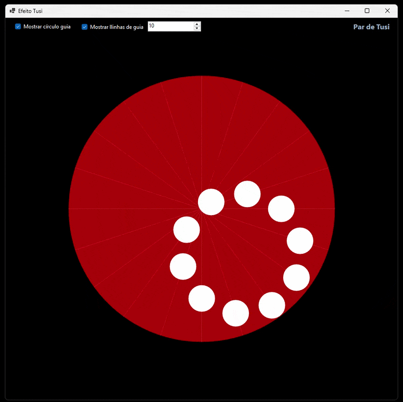

# Par de Tusi (Tusi Couple) em C# e .NET 8

Este projeto consiste em uma implementação em Windows Forms (.NET 8) do conceito geométrico conhecido como **Par de Tusi**. A aplicação demonstra visualmente como a combinação de múltiplos movimentos lineares e independentes pode resultar em um movimento circular perfeito e coordenado.

## 📜 Contexto Histórico

O dispositivo geométrico foi descrito pela primeira vez em 1247 pelo astrônomo e matemático persa **Nasir al-Din al-Tusi** (1201–1274), em sua obra *Tadhkira fi 'ilm al-hay'a* (Memória sobre a Ciência da Astronomia). 

Al-Tusi desenvolveu este modelo como uma ferramenta teórica para resolver anomalias nos movimentos planetários descritos no sistema ptolemaico, demonstrando que um movimento retilíneo poderia ser gerado a partir de movimentos circulares uniformes. Séculos mais tarde, o conceito foi fundamental para os estudos astronômicos da revolução copernicana.

## 📐 Fundamentação Matemática

O projeto utiliza os princípios do **Movimento Harmônico Simples (MHS)** e da trigonometria analítica para calcular a trajetória de cada elemento na tela.

### 1. Definição das Linhas de Referência (Diâmetros)
Para um total de $N$ círculos menores (bolinhas), o círculo principal é dividido em $N$ diâmetros equivalentes. O ângulo $\theta_i$ de cada linha guia $i$ (onde $0 \le i < N$) é calculado por:

$$\theta_i = \frac{i \times \pi}{N}$$

### 2. Equação do Movimento Harmônico Simples (Distância)
Cada bolinha oscila de forma linear ao longo de sua respectiva linha guia. Para evitar que o corpo da bolinha ultrapasse a borda do círculo maior, a amplitude máxima do movimento é limitada descontando-se o raio menor ($R_{max} = R_{maior} - R_{menor}$). 

A distância instantânea $d$ de cada esfera em relação ao centro do plano, em função do tempo acumulado $t$, é dada por:

$$d = R_{max} \times \cos(t + \theta_i)$$

### 3. Projeção Cartesiana $(X, Y)$
Após determinar a distância linear $d$ no eixo da linha guia, o programa realiza a projeção para coordenadas de pixels $(X, Y)$ na tela do Windows Forms, aplicando o deslocamento para centralização no Canvas:

$$X = X_{centro} + d \times \cos(\theta_i) - R_{menor}$$
$$Y = Y_{centro} + d \times \sin(\theta_i) - R_{menor}$$

## 🚀 Características Técnicas do Projeto

* **Arquitetura Orientada a Objetos:** Separação estrita entre a camada de interface (`frmEfeitoTusi`) e a camada de física/matemática (`CalculoHMS`).
* **Otimização de Renderização:** Uso de `DoubleBuffered` ativo para eliminação de *flicker* (piscadas de tela) e `SmoothingMode.AntiAlias` para suavização de serrilhados.
* **Gerenciamento de Memória Eficiente:** Alocação estática de recursos gráficos (`Pen` e `SolidBrush`) no escopo do formulário, evitando sobrecarga do *Garbage Collector* em loops de alta frequência (60 FPS).
* **Escalonamento Dinâmico:** Algoritmo inteligente que reduz o diâmetro das esferas proporcionalmente à medida que o usuário aumenta o número de linhas, preservando a harmonia visual da ilusão estética.

